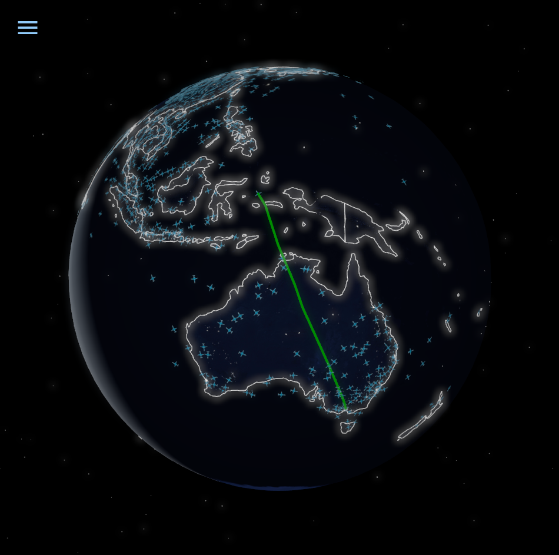
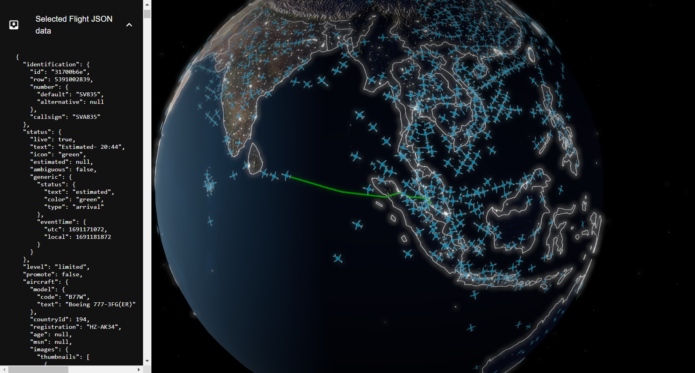
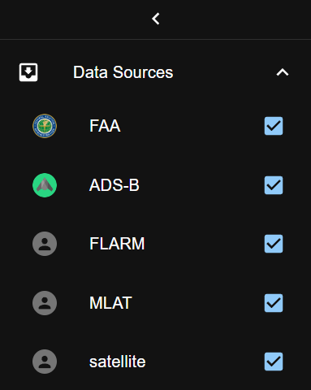
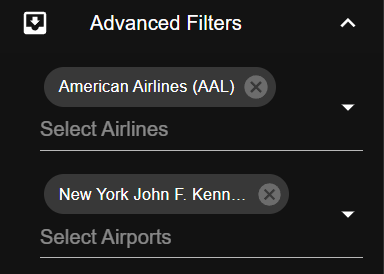
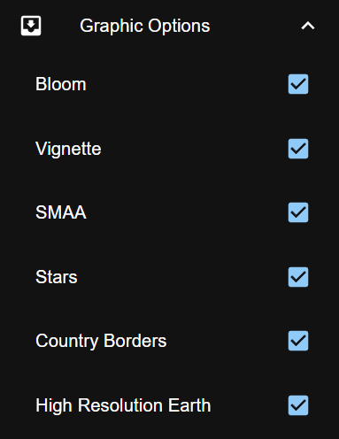

<div style="text-align: center;">
    <h1><b>React Flight Tracker</b></h1>
    
    <p>3D Visualization of Flight Data using React and Three.js</p>


</div>

## Table of Contents

- [About](#about)
- [Technologies](#technologies)
- [Getting Started](#getting-started)
- [Usage](#usage)
- [Contributing](#contributing)
- [License](#license)
- [Contact](#contact)

## About

This project is a 3D visualization of flight data using React and Three.js.
The data is provided by the FlightRadar24 API using the
library [flightradar24-client-ts](https://www.npmjs.com/package/flightradar24-client-ts).

The project is deployed on kubernetes using flux CD.
The CI/CD pipeline is managed by Gitlab CI/CD and updates are automatically deployed to the
dev([develop branch](https://gitlab.com/dev6645326/react-flight-tracker/-/tree/develop)) and
prod([master branch](https://gitlab.com/dev6645326/react-flight-tracker/-/tree/master)) environments.

The dev environment is deployed
at [https://react-flight-tracker.dev.apoorva64.com/](https://react-flight-tracker.dev.apoorva64.com/).
The prod environment is deployed
at [https://react-flight-tracker.apoorva64.com/](https://react-flight-tracker.apoorva64.com/).

## Technologies


## Getting Started

### Prerequisites

- Node.js
- npm
- Docker

### Installation

1. Clone the repo

```sh
git clone https://gitlab.com/dev6645326/react-flight-tracker.git
```

2. Install NPM packages

```sh
yarn
```

3. Start the development server

```sh
yarn dev
```

## Usage

### Flight Visualization

Click on a plane to view its flight path. The flight path is displayed as a line connecting the plane's current position
to its start position.
The JSON data is displayed in the menu on the left.


### Filter Flights

#### Filter flights by datasource



#### Filter flights by airport, airline



#### Graphics Settings



## Contributing

Contributions are what make the open source community such an amazing place to learn, inspire, and create.
Any contributions you make are **greatly appreciated**.

## License

Distributed under the MIT License. See `LICENSE` for more information.

## Contact

[](https://github.com/Apoorva64)
[](https://gitlab.com/Apoorva64)
[](https://www.linkedin.com/in/appadoo-apoorva-srinivas-481367207/)

## Acknowledgements
- [Great Tutorial on calculating the position of astral objects](https://stjarnhimlen.se/comp/tutorial.html)